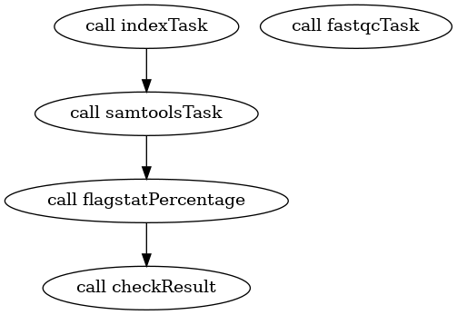

Инструкция для запуска пайплайна:
* Скачать `cromwell-70.jar` и `womtool-70.jar` с [гитхаба](https://github.com/broadinstitute/cromwell/releases/latest);
* Выполнить `java -jar cromwell-70.jar run pipeline.wdl -i pipeline.json`;
* Выполнить `java -jar womtool-70.jar graph pipeline.wdl | dot -Tpng > pipeline.png` для визуализации.

Результат:

Отличие полученной визуализации от блок-схемы заключается в том, что фаза FastQC изображена обособленно (так как получаемые файлы не используются в других фазах).
